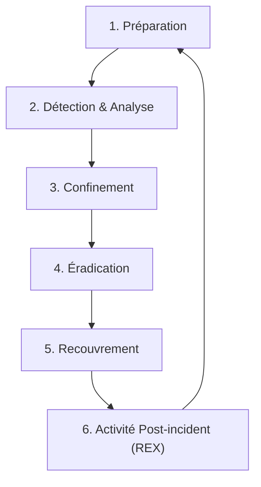

# Session B18 — Introduction à la réponse aux incidents

## Objectifs de la session
À la fin de cette session, vous serez capable de :

* Citer et détailler les 6 phases du cycle de gestion des incidents de sécurité selon le standard international NIST SP 800-61 r2.
* Distinguer et planifier les étapes clés de confinement, d'éradication et de recouvrement après une cyberattaque.
* Rédiger une fiche réflexe opérationnelle (Playbook d'action rapide) pour guider un premier intervenant face à une attaque par rançongiciel.

---

## Concepts clés

### 1. Le cycle de réponse aux incidents (NIST SP 800-61 r2)
Faire face à une cyberattaque ne s'improvise pas. L'institut de normalisation américain NIST a structuré le cycle de vie de la réponse à incident en **6 étapes chronologiques et itératives** :



1.  **La Préparation** : Construire les défenses, sécuriser et tester les sauvegardes hors ligne, former les équipes techniques et rédiger les procédures d'urgence (**Playbooks**).
2.  **La Détection et l'Analyse** : Détecter les premiers indices d'une intrusion (alertes SIEM, rapports d'utilisateurs), analyser la sévérité et identifier la nature de l'attaque.
3.  **Le Confinement** : Limiter la propagation de la menace au reste du réseau pour protéger les systèmes encore sains (ex. isoler une machine compromise).
4.  **L'Éradication** : Nettoyer les systèmes infectés en supprimant les programmes malveillants, en fermant les comptes compromis et en corrigeant les failles exploitées par l'attaquant.
5.  **Le Recouvrement (Récupération)** : Restaurer les systèmes affectés à partir de sauvegardes saines, valider leur bon fonctionnement et surveiller étroitement le retour en production.
6.  **L'Activité Post-incident (Retour d'Expérience - REX)** : Analyser les défaillances ayant permis l'attaque, documenter les leçons apprises et mettre à jour la PSSI et les processus pour éviter toute récidive.

### 2. Confinement, Éradication et Recouvrement
Ces trois étapes constituent le cœur opérationnel de la gestion d'un incident actif :

*   **Confinement** : On stoppe l'hémorragie. L'objectif n'est pas encore de réparer, mais d'éviter que la menace n'atteigne d'autres serveurs.
*   **Éradication** : On assainit. On cherche toutes les portes dérobées (*backdoors*) créées par le pirate pour s'assurer qu'il ne pourra pas revenir.
*   **Recouvrement** : On redémarre. On remet les services en ligne progressivement en s'assurant que les vulnérabilités de départ ont bien été corrigées.

*L'analogie de l'incendie de cuisine* :

*   Le **confinement** consiste à fermer la porte de la cuisine pour empêcher la fumée et les flammes d'envahir le reste de la maison.
*   L'**éradication** consiste à utiliser l'extincteur pour éteindre le feu à sa source et enlever les débris brûlés.
*   Le **recouvrement** consiste à nettoyer la suie, repeindre les murs et installer une nouvelle cuisinière pour reprendre une activité normale.

### 3. Préservation des preuves : la règle d'or de la RAM
Lorsqu'un utilisateur ou un technicien découvre qu'une machine est victime d'une attaque active (ex. fichiers qui se chiffrent en direct par un ransomware), le premier réflexe est souvent d'éteindre brusquement l'ordinateur en restant appuyé sur le bouton d'alimentation ou en débranchant la prise électrique.

> [!WARNING]
> **Ne jamais éteindre brutalement une machine compromise !**
> *   **Destruction de la mémoire vive (RAM)** : La RAM est une mémoire volatile. Si vous éteignez la machine, toutes les données en cours d'exécution sont définitivement effacées. Or, c'est en RAM que se trouvent les indices les plus précieux : les processus malveillants actifs, les connexions réseau en cours, les adresses IP des pirates, et parfois même **la clé de déchiffrement du rançongiciel**.
> *   **Accélération des dommages** : Certains malwares profitent du redémarrage pour chiffrer les fichiers de démarrage du système d'exploitation et rendre la machine définitivement inutilisable.
> *   **La bonne pratique** : **Isoler du réseau** en débranchant le câble Ethernet et en désactivant le Wi-Fi, mais **laisser la machine allumée** pour permettre au SOC d'extraire la mémoire vive.

---

## Activités / exercices

### Exercice 1 — Rdaction d'un Playbook "Premier Répondant Ransomware"
**Objectif :** Rédiger une fiche de procédure claire, séquentielle et dénuée de jargon technique complexe, utilisable immédiatement par le technicien du centre d'appels informatique (Helpdesk) lorsqu'un employé appelle paniqué.

**Consignes :**
L'entreprise EcoLog souhaite créer sa fiche d'action d'urgence pour le Helpdesk. Rédigez les 5 étapes chronologiques et impératives que le technicien Helpdesk doit appliquer et faire appliquer à l'utilisateur au téléphone en cas de détection d'un ransomware.

**Corrigé / Éléments de réponse :**

```text
FICHE RÉFLEXE : SIGNALEMENT DE RANSOMGICIEL (HELP-DESK)
--------------------------------------------------------------------------------
DÉFINITION : L'utilisateur signale un écran bloqué avec une demande de rançon,
ou des fichiers professionnels impossibles à ouvrir avec une extension ".locked".

Étape 1 : ISOLATION DU RÉSEAU (Action immédiate de l'utilisateur)
-> Demander à l'utilisateur de débrancher immédiatement le câble réseau (Ethernet)
   de sa machine et de désactiver le Wi-Fi (activer le mode avion).
   *Pourquoi ?* Pour bloquer la propagation du virus vers les serveurs de fichiers
   partagés de l'entreprise.

Étape 2 : MAINTIEN DE L'ALIMENTATION ÉLECTRIQUE
-> Ordonner formellement à l'utilisateur de LAISSER LA MACHINE ALLUMÉE.
   Ne pas éteindre, ne pas redémarrer.
   *Pourquoi ?* Pour préserver la mémoire vive (RAM) qui contient les preuves
   techniques et potentiellement la clé de déchiffrement.

Étape 3 : COLLECTE DES PREMIÈRES INFORMATIONS
-> Demander à l'utilisateur :

   - L'heure exacte du premier message d'erreur ou du comportement anormal.
   - Le message affiché à l'écran (lui demander de prendre une photo de l'écran
     avec son téléphone portable et de l'envoyer par SMS/canal secondaire).

   - Les noms des derniers fichiers ou dossiers ouverts avant le blocage.

Étape 4 : SIGNALEMENT AUX RESPONSABLES DE SÉCURITÉ (Escalade)
-> Créer un ticket d'incident prioritaire avec le tag [CRITIQUE - RANSOMWARE].
   Alerter immédiatement par téléphone le RSSI et l'analyste SOC de garde.
   Leur communiquer l'adresse IP de la machine, le nom de l'utilisateur et la photo
   du message de rançon.

Étape 5 : CONSIGNATION DE L'INCIDENT
-> Rédiger un compte rendu factuel dans l'outil de gestion d'incidents détaillant
   l'heure d'appel, les actions menées par le helpdesk, et l'heure d'isolation
   physique de la machine.
```

---

## Questions de réflexion
1. Pourquoi la phase "Activité Post-incident" (Leçons apprises) est-elle souvent négligée par les entreprises ? Quel est le risque de sauter cette étape une fois la production rétablie ?
2. Imaginez qu'une entreprise restaure ses serveurs à partir de sauvegardes datant de la veille de l'attaque sans avoir identifié la vulnérabilité d'origine. Quel événement risquez-vous de voir se produire dans les heures qui suivent le recouvrement ?

---

## Résumé / points à retenir
*   La gestion des incidents est un processus normalisé par le **NIST SP 800-61** en 6 étapes, de la préparation au retour d'expérience (REX).
*   En cas d'attaque par ransomware, l'urgence absolue est le **confinement** (isoler physiquement ou logiquement les machines du réseau).
*   Il ne faut **jamais éteindre électriquement** une machine infectée pour ne pas détruire les indices précieux localisés dans la **mémoire vive (RAM)**.
*   Les **Playbooks** (ou fiches réflexes) permettent aux équipes de réagir de manière calme et coordonnée en situation de stress cyber.

---

## Glossaire de la session
*   **Playbook** — Procédure de sécurité documentée détaillant pas à pas les actions à mener face à un type d'incident spécifique.
*   **Mémoire Volatile (RAM)** — Mémoire informatique à accès rapide effacée dès que l'alimentation électrique est coupée.
*   **REX (Retour d'Expérience)** : Analyse menée après la clôture d'un incident pour identifier les failles du processus de réponse et s'améliorer.
*   **NIST SP 800-61** — Guide de référence du gouvernement américain détaillant les bonnes pratiques de gestion des incidents de sécurité.

---

## Pour aller plus loin (self-paced)
*   **Sur IBM SkillsBuild** : Suivre le cours *"Incident Response Fundamentals"* (durée estimée : 1h30).
*   **Étude documentaire** : Télécharger le modèle de plan de réponse à incident fourni gratuitement par l'ANSSI pour observer comment s'organise une cellule de crise au niveau national.
